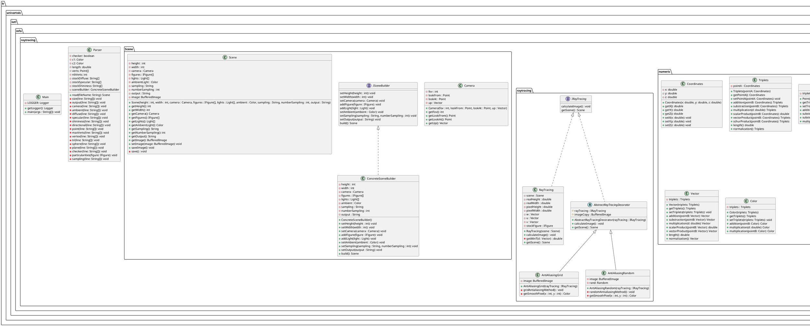

# Diagramme uml du projet :

```plantuml
@startuml Raytracing

package fr.univartois.iutl.info.raytracing {
    package checkerboard {
        interface ICalculateMethod {
            calculate(point: Point, taille: double, scene: Scene, t: double, d: Vector, stockFigure: IFigure, c1: Color, c2: Color): Color
        }
        
        class CalculateFull implements ICalculateMethod {
            +calculate(point: Point, size: double, scene: Scene, t: double, d: Vector, stockFigure: IFigure, c1: Color, c2: Color): Color
        }
        
        class CalculateChecked implements ICalculateMethod {
            +calculate(point: Point, size: double, scene: Scene, t: double, d: Vector, stockFigure: IFigure, c1: Color, c2: Color): Color
        }
    }

    package figure {
        interface IFigure {
            getOrigin(): Point
            findInteraction(lookFrom : Point, d : Vector): double
            getDiffuse : Color
            getSpecular : Color
            getShininess : int
            setDiffuse(diffuse : Color): void
            setSpecular(specular : Color): void
            setShininess(shininess : int): void
        }

        class Sphere implements IFigure {
            -center : Point
            -radius : double
            -diffuse : Color
            -specular : Color
            -shininess : int

            +Sphere(center : Point, radius : double)
            +getOrigin(): Point
            +getCenter(): Point
            +getRadius(): double
            +findInteraction(lookFrom : Point, d : Vector): double
            +getDiffuse() : Color
            +getSpecular() : Color
            +getShininess() : int
            +setDiffuse(diffuse : Color): void
            +setSpecular(specular : Color): void
            +setShininess(shininess : int): void
        }

        class Plane implements IFigure {
            - point: Point
            - normal: Vector
            - diffuse: Color
            - specular: Color
            - shininess: int
            - checker: boolean
            - length: double
            - c1: Color
            - c2: Color
            
            + Plane(point: Point, normal: Vector)
            + Plane(point: Point, normal: Vector, c1: Color, c2: Color, length: double)
            + getOrigin(): Point
            + getNormal(): Vector
            + findInteraction(lookFrom: Point, d: Vector): double
            + getDiffuse(): Color
            + getSpecular(): Color
            + getShininess(): int
            + setDiffuse(diffuse: Color): void
            + setSpecular(specular: Color): void
            + setShininess(shininess: int): void
        }

        class Triangle implements IFigure{
            -pointA : Point
            -pointB : Point
            -pointC : Point
            -diffuse : Color
            -specular : Color
            -shininess : int

            +Triangle(pointA : Point, pointB : Point, pointC : Point)
            +getOrigin(): Point
            +getPointA(): Point
            +getPointB(): Point
            +getPointC(): Point
            +findInteraction(lookFrom : Point, d : Vector): double
            +getDiffuse() : Color
            +getSpecular() : Color
            +getShininess() : int
            +setDiffuse(diffuse : Color): void
            +setSpecular(specular : Color): void
            +setShininess(shininess : int): void
        }
    }
    
    package light {
        interface Light {
            getCoordinates(): Vector
            setCoordinates(coordinates : Vector): void
            getColor(): Color
            setColors(colors : Color): void
        }

        class DirectionalLight implements Light {
            -vector : Vector
            -coordinates : Vector
            -colors : Color

            +DirectionalLight(colors : Color, vector : Vector)
            +getCoordinates(): Vector
            +setCoordinates(coordinates : Vector): void
            +getColors(): Color
            +setColors(colors : Color): void
            +getVector(): Vector
            +setVector(vector : Vector): void
            +getDirection() : Vector
        }

        class PunctialLight implements Light {
            - point : Point
            -coordinates : Vector
            -colors : Color

            +PunctialLight(point : Point, colors : Color)
            +getCoordinates(): Vector
            +setCoordinates(coordinates : Vector): void
            +getColors(): Color
            +setColors(colors : Color): void
            + getPoint(): Point
            + setPoint(point: Point): void
            +getDirection() : Vector
        }

        interface Calculator {
            calculateColor(scene : Scene, t : double, d: Vector, figure : IFigure, cDiffuse : Color): Color
        }

        class BaseColor implements Calculator {
            +calculateColor(scene : Scene, t : double, d: Vector, figure : IFigure, cDiffuse : Color): Color
        }

        class LambertDecorator implements Calculator {
            - calculator : Calculator

            + LambertDecorator(calculator: Calculator)
            + calculatorColor(scene: Scene, t: double, d: Vector, figure: IFigure, cDiffuse: Color): Color
            + getCalculator(): Calculator
            + setCalculator(calculator: Calculator): void
        }
    }

    package numeric {
        class Coordinates {
            -x: double
            -y: double
            -z: double
            
            +Coordinates(x: double, y: double, z: double) 
            +getX(): double
            +getY(): double
            +getZ(): double
            +setX(x: double): void
            +setY(y: double): void
            +setZ(z: double): void
        }
    
        class Triplets {
            -pointA : Coordinates
            
            +Triplets(pointA: Coordinates)
            +getPointA(): Coordinates
            +setPointA(pointA: Coordinates): void
            +addition(pointB: Coordinates): Triplets
            +substraction(pointB: Coordinates): Triplets
            +multiplication(d: double): Triplets
            +scalarProduct(pointB: Coordinates): double
            +vectorProduct(pointB: Coordinates): Triplets
            +schurProduct(pointB: Coordinates): Triplets
            +length(): double
            +normalization(): Triplets
        }
    
        class Point {
            -triplets : Triplets
            
            +Point(triplets: Triplets)
            +getTriplets(): Triplets
            +setTriplets(triplets: Triplets): void
            +addition(pointB: Vector): Point
            +substraction(pointB: Point): Vector
            +substraction(pointB: Vector): Point
            +multiplication(d: double): Point
        }
    
        class Vector {
            -triplets : Triplets
            
            +Vector(triplets: Triplets)
            +getTriplets(): Triplets
            +setTriplets(triplets: Triplets): void
            +addition(pointB: Vector): Vector
            +substraction(pointB: Vector): Vector
            +multiplication(d: double): Vector
            +scalarProduct(pointB: Vector): double
            +vectorProduct(pointB: Vector): Vector
            +length(): double
            +normalization(): Vector
        }
    
         class Color {
            -triplets : Triplets
            
            +Color(triplets: Triplets)
            +getTriplets(): Triplets
            +setTriplets(triplets: Triplets): void
            +addition(pointB: Color): Color
            +multiplication(d: double): Color
            +multiplication(pointB: Color): Color
        }        
    }

    package raytracing {
        interface IRayTracing {
            calculateImage() : void
            getScene() : Scene
        }

        class RayTracing implements IRayTracing {
            -scene : Scene
            -realHeight : double
            -realWidth : double
            -pixelHeight : double
            -pixelWidth : double
            -w : Vector
            -u : Vector
            -v : Vector
            -stockFigure : IFigure

            +RayTracing(scene : Scene)
            +calculateImage() : void
            -getMinT(d : Vector) : double
            +getScene() : Scene
        }

        abstract class AbstractRayTracingDecorator implements IRayTracing {
            # rayTracing : IRayTracing
            # imageCopy : BufferedImage

            +AbstractRayTracingDecorator(rayTracing : IRayTracing)
            +calculateImage() : void
            +getScene() : Scene
        }

        class AntiAliasingGrid extends AbstractRayTracingDecorator {
            - image: BufferedImage
            
            +AntiAliasingGrid(rayTracing : IRayTracing)
            -gridAntialiasingMethod() : void
            -getSmoothPixel(x : int, y : int) : Color
        }

        class AntiAliasingRandom extends AbstractRayTracingDecorator {
            - image: BufferedImage
            - rand: Random
            
            +AntiAliasingRandom(rayTracing : IRayTracing)
            -randomAntialiasingMethod() : void
            -getSmoothPixel(x : int, y : int) : Color
        }
    }
    
    package Scene {
        class Camera {
            -fov : int
            -lookFrom : Point
            -lookAt : Point
            -up : Vector

            +Camera(fov : int, lookFrom : Point, lookAt : Point, up : Vector)
            +getFov(): int
            +getLookFrom(): Point
            +getLookAt(): Point
            +getUp(): Vector
        }

        interface ISceneBuilder {
            setHeight(height : int): void
            setWidth(width : int): void
            setCamera(camera : Camera): void
            addFigure(figure : IFigure): void
            addLight(light : Light): void
            setAmbient(ambient : Color): void
            setSampling(sampling : String, numberSampling : int): void
            setOutput(output : String): void
            build(): Scene
        } 

        class ConcreteSceneBuilder implements ISceneBuilder{
            -height : int
            -width : int
            -camera : Camera
            -figures : IFigure[]
            -lights : Light[]
            -ambient : Color
            -sampling : String
            -numberSampling : int
            -output : String

            +ConcreteSceneBuilder()
            +setHeight(height : int): void
            +setWidth(width : int): void
            +setCamera(camera : Camera): void
            +addFigure(figure : IFigure): void
            +addLight(light : Light): void
            +setAmbient(ambient : Color): void
            +setSampling(sampling : String, numberSampling : int): void
            +setOutput(output : String): void
            +build(): Scene
        }

        class Scene {
            -height : int
            -width : int
            -camera : Camera
            -figures : IFigure[]
            -lights : Light[]
            -ambientLight : Color
            -sampling : String
            -numberSampling : int
            -output : String
            - image: BufferedImage

            +Scene(height : int, width : int, camera : Camera, figures : IFigure[], lights : Light[], ambient : Color, sampling : String, numberSampling : int, output : String)
            +getHeight(): int
            +getWidth(): int
            +getCamera(): Camera
            +getFigures(): IFigure[]
            +getLights(): Light[]
            +getAmbientLight(): Color
            +getSampling(): String
            +getNumberSampling(): int
            +getOutput(): String
            + getImage(): BufferedImage
            + setImage(image: BufferedImage): void
            +saveImage(): void
            -save() : void
        }
    }

    class Parser {
        - checker: boolean
        - c1: Color
        - c2: Color
        - length: double
        - verts: Point[]
        - nbVerts: int
        - stockDiffuse: String[]
        - stockSpecular: String[]
        - stockShininess: String[]
        - sceneBuilder: ConcreteSceneBuilder
        + read(fileName: String): Scene
        - size(line: String[]): void
        - output(line: String[]): void
        - camera(line: String[]): void
        - ambient(line: String[]): void
        - diffuse(line: String[]): void
        - specular(line: String[]): void
        - shininess(line: String[]): void
        - directional(line: String[]): void
        - point(line: String[]): void
        - maxVerts(line: String[]): void
        - vertex(line: String[]): void
        - tri(line: String[]): void
        - sphere(line: String[]): void
        - plane(line: String[]): void
        - checker(line: String[]): void
        - particularities(figure: IFigure): void
        - sampling(line: String[]): void
    }

    class Main {
        - LOGGER: Logger
        
        + getLogger(): Logger
        + main(args : String[]): void
    }

}
@enduml
```