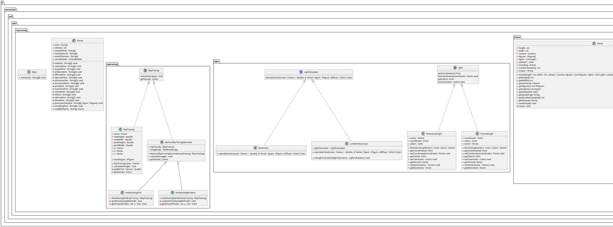

# Diagramme uml du projet : 

```plantuml
@startuml Raytracing

package fr.univartois.iutl.info.raytracing {
package numeric {
    class Coordinates {
        -x: double
        -y: double
        -z: double
        +Coordinates(x: double, y: double, z: double) 
        +getX(): double
        +getY(): double
        +getZ(): double
        +setX(x: double): void
        +setY(y: double): void
        +setZ(z: double): void
    }

    class Triplets {
        -pointA : Coordinates
        +Triplets(pointA: Coordinates)
            +getPointA(): Coordinates
            +setPointA(pointA: Coordinates): void
            +addition(pointB: Coordinates): Triplets
            +substraction(pointB: Coordinates): Triplets
            +multiplication(d: double): Triplets
            +scalarProduct(pointB: Coordinates): double
            +vectorProduct(pointB: Coordinates): Triplets
            +schurProduct(pointB: Coordinates): Triplets
            +length(): double
            +normalization(): Triplets
        }

        class Point {
            -triplets : Triplets

            +Point(triplets: Triplets)
            +getTriplets(): Triplets
            +setTriplets(triplets: Triplets): void
            +addition(pointB: Vector): Point
            +substraction(pointB: Point): Point
            +substraction(pointB: Vector): Point
            +multiplication(d: double): Point
        }

        class Vector {
            -triplets : Triplets

            +Vector(triplets: Triplets)
            +getTriplets(): Triplets
            +setTriplets(triplets: Triplets): void
            +addition(pointB: Vector): Vector
            +substraction(pointB: Vector): Vector
            +multiplication(d: double): Vector
            +scalarProduct(pointB: Vector): double
            +vectorProduct(pointB: Vector): Vector
            +length(): double
            +normalization(): Vector
        }

        class Color {
            -triplets : Triplets
            
            +Color(triplets: Triplets)
            +getTriplets(): Triplets
            +setTriplets(triplets: Triplets): void
            +addition(pointB: Color): Color
            +multiplication(d: double): Color
            +multiplication(pointB: Color): Color
        }        
    }

    package figure {
        interface IFigure {
            getOrigin(): Point
            findInteraction(lookFrom : Point, d : Vector): double
            getDiffuse : Color
            getSpecular : Color
            getShininess : int
            setDiffuse(diffuse : Color): void
            setSpecular(specular : Color): void
            setShininess(shininess : int): void
        }

        class Sphere implements IFigure {
            -center : Point
            -radius : double
            -diffuse : Color
            -specular : Color
            -shininess : int

            +Sphere(center : Point, radius : double)
            +getOrigin(): Point
            +getCenter(): Point
            +getRadius(): double
            +findInteraction(lookFrom : Point, d : Vector): double
            +getDiffuse : Color
            +getSpecular : Color
            +getShininess : int
            +setDiffuse(diffuse : Color): void
            +setSpecular(specular : Color): void
            +setShininess(shininess : int): void
        }

        class Plane implements IFigure {
            -point : Point
            -normal : Vector
            -diffuse : Color
            -specular : Color
            -shininess : int

            +Plane(point : Point, normal : Vector)
            +getOrigin(): Point
            +getNormal(): Vector
            +findInteraction(lookFrom : Point, d : Vector): double
            +getDiffuse : Color
            +getSpecular : Color
            +getShininess : int
            +setDiffuse(diffuse : Color): void
            +setSpecular(specular : Color): void
            +setShininess(shininess : int): void
        }

        class Triangle implements IFigure{
            -pointA : Point
            -pointB : Point
            -pointC : Point
            -diffuse : Color
            -specular : Color
            -shininess : int

            +Triangle(pointA : Point, pointB : Point, pointC : Point)
            +getOrigin(): Point
            +getPointA(): Point
            +getPointB(): Point
            +getPointC(): Point
            +findInteraction(lookFrom : Point, d : Vector): double
            +getDiffuse : Color
            +getSpecular : Color
            +getShininess : int
            +setDiffuse(diffuse : Color): void
            +setSpecular(specular : Color): void
            +setShininess(shininess : int): void
        }
    }

    package Scene {
        class Camera {
            -fov : int
            -lookFrom : Point
            -lookAt : Point
            -up : Vector

            +Camera(fov : int, lookFrom : Point, lookAt : Point, up : Vector)
            +getFov(): int
            +getLookFrom(): Point
            +getLookAt(): Point
            +getUp(): Vector
        }

        interface ISceneBuilder {
            setHeight(height : int): void
            setWidth(width : int): void
            setCamera(camera : Camera): void
            addFigure(figure : IFigure): void
            addLight(light : Light): void
            setAmbient(ambient : Color): void
            setSampling(sampling : String, numberSampling : int): void
            setOutput(output : String): void
            build(): Scene
        } 

        class ConcreteSceneBuilder implements ISceneBuilder{
            -height : int
            -width : int
            -camera : Camera
            -figures : List<IFigure>
            -lights : List<Light>
            -ambient : Color
            -sampling : String
            -numberSampling : int
            -output : String

            +ConcreteSceneBuilder()
            +setHeight(height : int): void
            +setWidth(width : int): void
            +setCamera(camera : Camera): void
            +addFigure(figure : IFigure): void
            +addLight(light : Light): void
            +setAmbient(ambient : Color): void
            +setSampling(sampling : String, numberSampling : int): void
            +setOutput(output : String): void
            +build(): Scene
        }

        class Scene {
            -height : int
            -width : int
            -camera : Camera
            -figures : IFigure[]
            -lights : List<Light>
            -ambient : Color
            -sampling : String
            -numberSampling : int
            -output : String

            +Scene(height : int, width : int, camera : Camera, figures : List<IFigure>, lights : List<Light>, ambient : Color, sampling : String, numberSampling : int, output : String)
            +getHeight(): int
            +getWidth(): int
            +getCamera(): Camera
            +getFigures(): List<IFigure>
            +getLights(): List<Light>
            +getAmbient(): Color
            +getSampling(): String
            +getNumberSampling(): int
            +getOutput(): String
            +saveImage(): void
            -save() : void
        }
    }

    package light {
        interface Light {
            getCoordinates(): Point
            setCoordinates(coordinates : Point): void
            getColor(): Color
            setColor(color : Color): void
        }

        class DirectionalLight implements Light{
            -vector : Vector
            -coordinates : Point
            -colors : Color

            +DirectionalLight(colors : Color, vector : Vector)
            +getCoordinates(): Point
            +setCoordinates(coordinates : Point): void
            +getColor(): Color
            +setColor(color : Color): void
            +getVector(): Vector
            +setVector(vector : Vector): void
            +getDirection() : Vector
        }

        class PunctialLight implements Light{
            -coordinates : Point
            -colors : Color
            -vector : Vector

            +PunctialLight(colors : Color, vector : Vector)
            +getCoordinates(): Point
            +setCoordinates(coordinates : Point): void
            +getColor(): Color
            +setColor(color : Color): void
            +getVector(): Vector
            +setVector(vector : Vector): void
            +getDirection() : Vector
        }

        interface LightCalculator {
            calculateColor(scene : Scene, t : double, d: Vector, figure : IFigure, cDiffuse : Color): Color
        }

        class BaseColor implements LightCalculator {
            +calculateColor(scene : Scene, t : double, d: Vector, figure : IFigure, cDiffuse : Color): Color

        }

        class LambertDecorator implements LightCalculator {
            -lightCalculator : LightCalculator

            +calculateColor(scene : Scene, t : double, d: Vector, figure : IFigure, cDiffuse : Color): Color

            +setLightCalculator(lightCalculator : LightCalculator): void
        }
    }

    package raytracing {
        interface IRayTracing {
            calculateImage() : void
            getScene() : Scene
        }

        class RayTracing implements IRayTracing {
            -scene : Scene
            -realHeight : double
            -realWidth : double
            -pixelHeight : double
            -pixelWidth : double
            -w : Vector
            -u : Vector
            -v : Vector

            -stockFigure : IFigure

            +RayTracing(scene : Scene)
            +calculateImage() : void
            -getMinT(d : Vector) : double
            +getScene() : Scene
        }

        abstract class AbstractRayTracingDecorator implements IRayTracing {
            -rayTracing : IRayTracing
            #imageCopy : BufferedImage

            +AbstractRayTracingDecorator(rayTracing : IRayTracing)
            +calculateImage() : void
            +getScene() : Scene
        }

        class AntiAliasingGrid extends AbstractRayTracingDecorator {
            +AntiAliasingGrid(rayTracing : IRayTracing)
            -gridAntialiasingMethod() : void
            -getSmoothPixel(x : int, y : int) : Color
        }

        class AntiAliasingRandom extends AbstractRayTracingDecorator {
            +AntiAliasingRandom(rayTracing : IRayTracing)
            -randomAntialiasingMethod() : void
            -getSmoothPixel(x : int, y : int) : Color
        }
    }

    class Parser {
        -verts : Point[]
        -nbVerts : int
        -stockDiffuse : String[]
        -stockSpecular : String[]
        -stockShininess : String[]
        -sceneBuilder : SceneBuilder

        -size(line : String[]): void
        -camera(line : String[]): void
        -output(line : String[]): void
        -ambient(line : String[]): void
        -diffuse(line : String[]): void
        -specular(line : String[]): void
        -shininess(line : String[]): void
        -directional(line : String[]): void
        -point(line : String[]): void
        -maxVerts(line : String[]): void
        -vertex(line : String[]): void
        -tri(line : String[]): void
        -sphere(line : String[]): void
        -plane(line : String[]): void
        -particularities(line : String[], figure : IFigure): void
        -sampling(line : String[]): void
        +read(fileName : String): Scene
    }

    class Main {
        +main(args : String[]): void
    }


}
@enduml
```